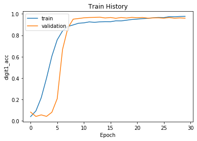

# 證交所買賣交易日報驗證碼

### 免責條款

此專案是個人學習如何使用 Deep Learning 中的 CNN，使用 Python 的 Keras、Tensorflow 進行實作，請勿使用於不法用途。若因使用該專案而侵害他人權利，請自行負責。

請參考 [證交所買賣日報](https://bsr.twse.com.tw/bshtm/use.htm) 使用條款

### 參考資料

其實基本上都是依照下面參考資料在實作，所以有疑問請在參考一下這些資料。

[如何透過OpenCV 破解台灣證券交易所買賣日報表的驗證碼(Captcha) (Part 1)?](https://www.youtube.com/watch?v=KESG8I9C3oA)

不過這專案主要是使用 Deep Learning 中的 CNN 影像辨識，而不是使用 pytesser 進行解碼。

### Dependencies

請先安裝相關的 python 套件

```sh
pip3 install -r requirements.txt
```

### 步驟

大致上分為四個步驟，以下會分步驟說明
- 爬蟲
- 預處理
- 標記圖片
- CNN深度學習

### 爬蟲

爬蟲請參考 `crawler.ipynb` 和編譯出來的 `crawler.py`。此程式使用 python requests 去抓取驗證碼存入至 captcha 目錄下。

檔案列表：

| # | ipython notebook 檔 | python檔 |
|---|---|---|
| 1 | crawler.ipynb |  |

### 預處理

圖片預處理就參考[參考資料](#參考資料)的 youtube 教學影片。另外在切割一下不需要的邊框，最後切成為 190 * 40 的圖片。

檔案列表：

| # | ipython notebook 檔 | python檔 |
|---|---|---|
| 1 | preprocess.ipynb |  |
| 2 | preprocess-batch.ipynb | preprocess-batch.py |

### 標記圖片

標記圖片花了很多時間，一開始使用我另外一個專案 [label_captcha_tool](https://github.com/maxmilian/label_captcha_tool) 進行標記。等到數量累積到一定量(>3000)後，並可以訓練並且使用爬蟲自動標記。自動標註請參考 `demo.ipynb`

這邊就標記檔，存成為 csv (`label.csv`)，每一個圖片一行，之後要丟入 CNN 當作 label 的訓練資料。

### CNN深度學習

CNN model 直接使用經典的VGG來改，不過為減小訓練時間，filters從32開始，並且加入了BatchNorm。

| # | ipython notebook 檔 | python檔 |
|---|---|---|
| 1 | cnn.ipynb | |

這邊就標記檔，存成為 csv，每一個圖片一行，之後要丟入 CNN 當作 label 的訓練資料。

model.summary()

```sh
Model: "model_1"
__________________________________________________________________________________________________
Layer (type)                    Output Shape         Param #     Connected to
==================================================================================================
input_1 (InputLayer)            (None, 40, 190, 3)   0
__________________________________________________________________________________________________
conv2d_1 (Conv2D)               (None, 40, 190, 32)  896         input_1[0][0]
__________________________________________________________________________________________________
conv2d_2 (Conv2D)               (None, 40, 190, 32)  9248        conv2d_1[0][0]
__________________________________________________________________________________________________
max_pooling2d_1 (MaxPooling2D)  (None, 20, 95, 32)   0           conv2d_2[0][0]
__________________________________________________________________________________________________
conv2d_3 (Conv2D)               (None, 20, 95, 64)   18496       max_pooling2d_1[0][0]
__________________________________________________________________________________________________
conv2d_4 (Conv2D)               (None, 20, 95, 64)   36928       conv2d_3[0][0]
__________________________________________________________________________________________________
max_pooling2d_2 (MaxPooling2D)  (None, 10, 47, 64)   0           conv2d_4[0][0]
__________________________________________________________________________________________________
conv2d_5 (Conv2D)               (None, 10, 47, 128)  73856       max_pooling2d_2[0][0]
__________________________________________________________________________________________________
conv2d_6 (Conv2D)               (None, 10, 47, 128)  147584      conv2d_5[0][0]
__________________________________________________________________________________________________
batch_normalization_1 (BatchNor (None, 10, 47, 128)  40          conv2d_6[0][0]
__________________________________________________________________________________________________
max_pooling2d_3 (MaxPooling2D)  (None, 5, 23, 128)   0           batch_normalization_1[0][0]
__________________________________________________________________________________________________
conv2d_7 (Conv2D)               (None, 5, 23, 256)   295168      max_pooling2d_3[0][0]
__________________________________________________________________________________________________
conv2d_8 (Conv2D)               (None, 5, 23, 256)   590080      conv2d_7[0][0]
__________________________________________________________________________________________________
max_pooling2d_4 (MaxPooling2D)  (None, 2, 11, 256)   0           conv2d_8[0][0]
__________________________________________________________________________________________________
conv2d_9 (Conv2D)               (None, 2, 11, 512)   1180160     max_pooling2d_4[0][0]
__________________________________________________________________________________________________
batch_normalization_2 (BatchNor (None, 2, 11, 512)   8           conv2d_9[0][0]
__________________________________________________________________________________________________
max_pooling2d_5 (MaxPooling2D)  (None, 1, 5, 512)    0           batch_normalization_2[0][0]
__________________________________________________________________________________________________
flatten_1 (Flatten)             (None, 2560)         0           max_pooling2d_5[0][0]
__________________________________________________________________________________________________
dropout_1 (Dropout)             (None, 2560)         0           flatten_1[0][0]
__________________________________________________________________________________________________
digit1 (Dense)                  (None, 27)           69147       dropout_1[0][0]
__________________________________________________________________________________________________
digit2 (Dense)                  (None, 27)           69147       dropout_1[0][0]
__________________________________________________________________________________________________
digit3 (Dense)                  (None, 27)           69147       dropout_1[0][0]
__________________________________________________________________________________________________
digit4 (Dense)                  (None, 27)           69147       dropout_1[0][0]
__________________________________________________________________________________________________
digit5 (Dense)                  (None, 27)           69147       dropout_1[0][0]
==================================================================================================
Total params: 2,698,199
Trainable params: 2,698,175
Non-trainable params: 24
__________________________________________________________________________________________________
```

model.fit log

Train on 8000 samples, validate on 2000 samples

Epoch 1/30
8000/8000 [==============================] - 387s 48ms/step - loss: 20.7603 - digit1_loss: 4.1218 - digit2_loss: 4.1246 - digit3_loss: 4.2006 - digit4_loss: 4.1233 - digit5_loss: 4.1901 - digit1_acc: 0.0397 - digit2_acc: 0.0417 - digit3_acc: 0.0390 - digit4_acc: 0.0421 - digit5_acc: 0.0385 - val_loss: 16.5830 - val_digit1_loss: 3.2236 - val_digit2_loss: 3.2770 - val_digit3_loss: 3.3399 - val_digit4_loss: 3.2676 - val_digit5_loss: 3.4749 - val_digit1_acc: 0.0820 - val_digit2_acc: 0.0600 - val_digit3_acc: 0.0645 - val_digit4_acc: 0.0715 - val_digit5_acc: 0.0350

Epoch 00001: saving model to model/01-20.76-16.58.hdf5
Epoch 2/30
8000/8000 [==============================] - 351s 44ms/step - loss: 16.6426 - digit1_loss: 3.2596 - digit2_loss: 3.2504 - digit3_loss: 3.2738 - digit4_loss: 3.2941 - digit5_loss: 3.5646 - digit1_acc: 0.0927 - digit2_acc: 0.0904 - digit3_acc: 0.0947 - digit4_acc: 0.0837 - digit5_acc: 0.0435 - val_loss: 19.3627 - val_digit1_loss: 4.0215 - val_digit2_loss: 3.9474 - val_digit3_loss: 3.9445 - val_digit4_loss: 4.0881 - val_digit5_loss: 3.3612 - val_digit1_acc: 0.0415 - val_digit2_acc: 0.0390 - val_digit3_acc: 0.0315 - val_digit4_acc: 0.0345 - val_digit5_acc: 0.0410

Epoch 00002: saving model to model/02-16.64-19.36.hdf5
Epoch 3/30
8000/8000 [==============================] - 321s 40ms/step - loss: 13.8183 - digit1_loss: 2.6223 - digit2_loss: 2.6177 - digit3_loss: 2.6298 - digit4_loss: 2.6576 - digit5_loss: 3.2907 - digit1_acc: 0.2161 - digit2_acc: 0.2124 - digit3_acc: 0.2137 - digit4_acc: 0.2010 - digit5_acc: 0.0845 - val_loss: 19.6083 - val_digit1_loss: 4.0990 - val_digit2_loss: 3.9981 - val_digit3_loss: 3.9873 - val_digit4_loss: 4.1572 - val_digit5_loss: 3.3667 - val_digit1_acc: 0.0560 - val_digit2_acc: 0.0725 - val_digit3_acc: 0.0495 - val_digit4_acc: 0.0705 - val_digit5_acc: 0.0405

Epoch 00003: saving model to model/03-13.82-19.61.hdf5
Epoch 4/30
8000/8000 [==============================] - 318s 40ms/step - loss: 10.7641 - digit1_loss: 1.9685 - digit2_loss: 1.9552 - digit3_loss: 1.9582 - digit4_loss: 2.0218 - digit5_loss: 2.8605 - digit1_acc: 0.4005 - digit2_acc: 0.3919 - digit3_acc: 0.4088 - digit4_acc: 0.3840 - digit5_acc: 0.1725 - val_loss: 22.4246 - val_digit1_loss: 4.8656 - val_digit2_loss: 4.6691 - val_digit3_loss: 4.5680 - val_digit4_loss: 4.7368 - val_digit5_loss: 3.5851 - val_digit1_acc: 0.0420 - val_digit2_acc: 0.0910 - val_digit3_acc: 0.0630 - val_digit4_acc: 0.0890 - val_digit5_acc: 0.0480

Epoch 00004: saving model to model/04-10.76-22.42.hdf5
Epoch 5/30
8000/8000 [==============================] - 318s 40ms/step - loss: 7.7654 - digit1_loss: 1.4199 - digit2_loss: 1.3889 - digit3_loss: 1.3698 - digit4_loss: 1.4353 - digit5_loss: 2.1515 - digit1_acc: 0.6046 - digit2_acc: 0.6111 - digit3_acc: 0.6193 - digit4_acc: 0.5956 - digit5_acc: 0.3516 - val_loss: 23.3641 - val_digit1_loss: 5.1337 - val_digit2_loss: 4.8523 - val_digit3_loss: 4.7477 - val_digit4_loss: 4.9166 - val_digit5_loss: 3.7138 - val_digit1_acc: 0.0805 - val_digit2_acc: 0.1280 - val_digit3_acc: 0.1050 - val_digit4_acc: 0.1100 - val_digit5_acc: 0.0855

Epoch 00005: saving model to model/05-7.77-23.36.hdf5
Epoch 6/30
8000/8000 [==============================] - 312s 39ms/step - loss: 5.6105 - digit1_loss: 1.0431 - digit2_loss: 1.0098 - digit3_loss: 1.0272 - digit4_loss: 1.0435 - digit5_loss: 1.4869 - digit1_acc: 0.7575 - digit2_acc: 0.7701 - digit3_acc: 0.7576 - digit4_acc: 0.7535 - digit5_acc: 0.5796 - val_loss: 16.6837 - val_digit1_loss: 3.7150 - val_digit2_loss: 3.5042 - val_digit3_loss: 3.4867 - val_digit4_loss: 3.5480 - val_digit5_loss: 2.4298 - val_digit1_acc: 0.2075 - val_digit2_acc: 0.2150 - val_digit3_acc: 0.2180 - val_digit4_acc: 0.2200 - val_digit5_acc: 0.2915

Epoch 00006: saving model to model/06-5.61-16.68.hdf5
Epoch 7/30
8000/8000 [==============================] - 313s 39ms/step - loss: 4.3520 - digit1_loss: 0.8228 - digit2_loss: 0.8022 - digit3_loss: 0.8063 - digit4_loss: 0.8409 - digit5_loss: 1.0798 - digit1_acc: 0.8407 - digit2_acc: 0.8482 - digit3_acc: 0.8475 - digit4_acc: 0.8321 - digit5_acc: 0.7509 - val_loss: 5.7227 - val_digit1_loss: 1.2170 - val_digit2_loss: 1.1729 - val_digit3_loss: 1.3032 - val_digit4_loss: 1.1101 - val_digit5_loss: 0.9196 - val_digit1_acc: 0.6670 - val_digit2_acc: 0.6805 - val_digit3_acc: 0.6605 - val_digit4_acc: 0.7035 - val_digit5_acc: 0.7935

Epoch 00007: saving model to model/07-4.35-5.72.hdf5
Epoch 8/30
8000/8000 [==============================] - 312s 39ms/step - loss: 3.5792 - digit1_loss: 0.6799 - digit2_loss: 0.6729 - digit3_loss: 0.6776 - digit4_loss: 0.6920 - digit5_loss: 0.8568 - digit1_acc: 0.8822 - digit2_acc: 0.8850 - digit3_acc: 0.8832 - digit4_acc: 0.8809 - digit5_acc: 0.8326 - val_loss: 3.3672 - val_digit1_loss: 0.6373 - val_digit2_loss: 0.6993 - val_digit3_loss: 0.7358 - val_digit4_loss: 0.6939 - val_digit5_loss: 0.6009 - val_digit1_acc: 0.8685 - val_digit2_acc: 0.8565 - val_digit3_acc: 0.8320 - val_digit4_acc: 0.8480 - val_digit5_acc: 0.8895

Epoch 00008: saving model to model/08-3.58-3.37.hdf5
Epoch 9/30
8000/8000 [==============================] - 311s 39ms/step - loss: 3.1446 - digit1_loss: 0.6080 - digit2_loss: 0.5872 - digit3_loss: 0.6011 - digit4_loss: 0.6083 - digit5_loss: 0.7400 - digit1_acc: 0.8967 - digit2_acc: 0.9040 - digit3_acc: 0.9012 - digit4_acc: 0.8987 - digit5_acc: 0.8624 - val_loss: 1.4332 - val_digit1_loss: 0.2910 - val_digit2_loss: 0.2647 - val_digit3_loss: 0.2875 - val_digit4_loss: 0.2560 - val_digit5_loss: 0.3340 - val_digit1_acc: 0.9505 - val_digit2_acc: 0.9575 - val_digit3_acc: 0.9485 - val_digit4_acc: 0.9630 - val_digit5_acc: 0.9350

Epoch 00009: saving model to model/09-3.14-1.43.hdf5
Epoch 10/30
8000/8000 [==============================] - 312s 39ms/step - loss: 2.8206 - digit1_loss: 0.5426 - digit2_loss: 0.5424 - digit3_loss: 0.5401 - digit4_loss: 0.5520 - digit5_loss: 0.6435 - digit1_acc: 0.9124 - digit2_acc: 0.9146 - digit3_acc: 0.9122 - digit4_acc: 0.9114 - digit5_acc: 0.8890 - val_loss: 1.1752 - val_digit1_loss: 0.2312 - val_digit2_loss: 0.2233 - val_digit3_loss: 0.2364 - val_digit4_loss: 0.2204 - val_digit5_loss: 0.2640 - val_digit1_acc: 0.9565 - val_digit2_acc: 0.9640 - val_digit3_acc: 0.9610 - val_digit4_acc: 0.9715 - val_digit5_acc: 0.9595

Epoch 00010: saving model to model/10-2.82-1.18.hdf5
Epoch 11/30
8000/8000 [==============================] - 310s 39ms/step - loss: 2.5845 - digit1_loss: 0.5067 - digit2_loss: 0.4971 - digit3_loss: 0.4934 - digit4_loss: 0.4968 - digit5_loss: 0.5905 - digit1_acc: 0.9160 - digit2_acc: 0.9147 - digit3_acc: 0.9147 - digit4_acc: 0.9165 - digit5_acc: 0.8956 - val_loss: 1.0955 - val_digit1_loss: 0.2216 - val_digit2_loss: 0.2006 - val_digit3_loss: 0.2261 - val_digit4_loss: 0.2038 - val_digit5_loss: 0.2434 - val_digit1_acc: 0.9630 - val_digit2_acc: 0.9635 - val_digit3_acc: 0.9630 - val_digit4_acc: 0.9705 - val_digit5_acc: 0.9610

Epoch 00011: saving model to model/11-2.58-1.10.hdf5
Epoch 12/30
8000/8000 [==============================] - 312s 39ms/step - loss: 2.3596 - digit1_loss: 0.4572 - digit2_loss: 0.4439 - digit3_loss: 0.4501 - digit4_loss: 0.4665 - digit5_loss: 0.5419 - digit1_acc: 0.9249 - digit2_acc: 0.9215 - digit3_acc: 0.9196 - digit4_acc: 0.9176 - digit5_acc: 0.9072 - val_loss: 0.9828 - val_digit1_loss: 0.1985 - val_digit2_loss: 0.1781 - val_digit3_loss: 0.2046 - val_digit4_loss: 0.1860 - val_digit5_loss: 0.2157 - val_digit1_acc: 0.9660 - val_digit2_acc: 0.9665 - val_digit3_acc: 0.9650 - val_digit4_acc: 0.9705 - val_digit5_acc: 0.9600

Epoch 00012: saving model to model/12-2.36-0.98.hdf5
Epoch 13/30
8000/8000 [==============================] - 321s 40ms/step - loss: 2.1610 - digit1_loss: 0.4303 - digit2_loss: 0.4102 - digit3_loss: 0.4096 - digit4_loss: 0.4168 - digit5_loss: 0.4942 - digit1_acc: 0.9211 - digit2_acc: 0.9254 - digit3_acc: 0.9219 - digit4_acc: 0.9246 - digit5_acc: 0.9089 - val_loss: 0.9777 - val_digit1_loss: 0.2048 - val_digit2_loss: 0.1711 - val_digit3_loss: 0.2059 - val_digit4_loss: 0.1754 - val_digit5_loss: 0.2205 - val_digit1_acc: 0.9670 - val_digit2_acc: 0.9655 - val_digit3_acc: 0.9660 - val_digit4_acc: 0.9730 - val_digit5_acc: 0.9610

Epoch 00013: saving model to model/13-2.16-0.98.hdf5
Epoch 14/30
8000/8000 [==============================] - 312s 39ms/step - loss: 1.9769 - digit1_loss: 0.3862 - digit2_loss: 0.3786 - digit3_loss: 0.3798 - digit4_loss: 0.3837 - digit5_loss: 0.4485 - digit1_acc: 0.9252 - digit2_acc: 0.9250 - digit3_acc: 0.9249 - digit4_acc: 0.9241 - digit5_acc: 0.9126 - val_loss: 0.9713 - val_digit1_loss: 0.1998 - val_digit2_loss: 0.1787 - val_digit3_loss: 0.2061 - val_digit4_loss: 0.1858 - val_digit5_loss: 0.2008 - val_digit1_acc: 0.9690 - val_digit2_acc: 0.9665 - val_digit3_acc: 0.9635 - val_digit4_acc: 0.9670 - val_digit5_acc: 0.9655

Epoch 00014: saving model to model/14-1.98-0.97.hdf5
Epoch 15/30
8000/8000 [==============================] - 314s 39ms/step - loss: 1.8043 - digit1_loss: 0.3540 - digit2_loss: 0.3511 - digit3_loss: 0.3478 - digit4_loss: 0.3423 - digit5_loss: 0.4091 - digit1_acc: 0.9271 - digit2_acc: 0.9290 - digit3_acc: 0.9259 - digit4_acc: 0.9300 - digit5_acc: 0.9161 - val_loss: 1.3438 - val_digit1_loss: 0.2497 - val_digit2_loss: 0.3033 - val_digit3_loss: 0.2842 - val_digit4_loss: 0.2778 - val_digit5_loss: 0.2288 - val_digit1_acc: 0.9615 - val_digit2_acc: 0.9455 - val_digit3_acc: 0.9555 - val_digit4_acc: 0.9580 - val_digit5_acc: 0.9680

Epoch 00015: saving model to model/15-1.80-1.34.hdf5
Epoch 16/30
8000/8000 [==============================] - 315s 39ms/step - loss: 1.6313 - digit1_loss: 0.3331 - digit2_loss: 0.3090 - digit3_loss: 0.3090 - digit4_loss: 0.3090 - digit5_loss: 0.3713 - digit1_acc: 0.9268 - digit2_acc: 0.9300 - digit3_acc: 0.9276 - digit4_acc: 0.9297 - digit5_acc: 0.9210 - val_loss: 0.9426 - val_digit1_loss: 0.2037 - val_digit2_loss: 0.1687 - val_digit3_loss: 0.1906 - val_digit4_loss: 0.1797 - val_digit5_loss: 0.1999 - val_digit1_acc: 0.9660 - val_digit2_acc: 0.9690 - val_digit3_acc: 0.9630 - val_digit4_acc: 0.9700 - val_digit5_acc: 0.9600

Epoch 00016: saving model to model/16-1.63-0.94.hdf5
Epoch 17/30
8000/8000 [==============================] - 312s 39ms/step - loss: 1.4433 - digit1_loss: 0.2831 - digit2_loss: 0.2807 - digit3_loss: 0.2725 - digit4_loss: 0.2761 - digit5_loss: 0.3309 - digit1_acc: 0.9347 - digit2_acc: 0.9329 - digit3_acc: 0.9331 - digit4_acc: 0.9337 - digit5_acc: 0.9242 - val_loss: 1.0249 - val_digit1_loss: 0.2214 - val_digit2_loss: 0.2030 - val_digit3_loss: 0.2121 - val_digit4_loss: 0.1952 - val_digit5_loss: 0.1933 - val_digit1_acc: 0.9590 - val_digit2_acc: 0.9610 - val_digit3_acc: 0.9630 - val_digit4_acc: 0.9630 - val_digit5_acc: 0.9680

Epoch 00017: saving model to model/17-1.44-1.02.hdf5
Epoch 18/30
8000/8000 [==============================] - 312s 39ms/step - loss: 1.2985 - digit1_loss: 0.2666 - digit2_loss: 0.2372 - digit3_loss: 0.2428 - digit4_loss: 0.2597 - digit5_loss: 0.2922 - digit1_acc: 0.9342 - digit2_acc: 0.9351 - digit3_acc: 0.9410 - digit4_acc: 0.9359 - digit5_acc: 0.9274 - val_loss: 0.9512 - val_digit1_loss: 0.1966 - val_digit2_loss: 0.1737 - val_digit3_loss: 0.2038 - val_digit4_loss: 0.1817 - val_digit5_loss: 0.1953 - val_digit1_acc: 0.9660 - val_digit2_acc: 0.9675 - val_digit3_acc: 0.9635 - val_digit4_acc: 0.9680 - val_digit5_acc: 0.9675

Epoch 00018: saving model to model/18-1.30-0.95.hdf5
Epoch 19/30
8000/8000 [==============================] - 312s 39ms/step - loss: 1.1341 - digit1_loss: 0.2245 - digit2_loss: 0.2165 - digit3_loss: 0.2166 - digit4_loss: 0.2171 - digit5_loss: 0.2594 - digit1_acc: 0.9407 - digit2_acc: 0.9424 - digit3_acc: 0.9406 - digit4_acc: 0.9455 - digit5_acc: 0.9346 - val_loss: 1.0491 - val_digit1_loss: 0.2136 - val_digit2_loss: 0.1968 - val_digit3_loss: 0.2344 - val_digit4_loss: 0.2051 - val_digit5_loss: 0.1991 - val_digit1_acc: 0.9610 - val_digit2_acc: 0.9625 - val_digit3_acc: 0.9590 - val_digit4_acc: 0.9630 - val_digit5_acc: 0.9625

Epoch 00019: saving model to model/19-1.13-1.05.hdf5
Epoch 20/30
8000/8000 [==============================] - 314s 39ms/step - loss: 0.9789 - digit1_loss: 0.1950 - digit2_loss: 0.1807 - digit3_loss: 0.1810 - digit4_loss: 0.1944 - digit5_loss: 0.2277 - digit1_acc: 0.9475 - digit2_acc: 0.9494 - digit3_acc: 0.9476 - digit4_acc: 0.9450 - digit5_acc: 0.9389 - val_loss: 0.9958 - val_digit1_loss: 0.2033 - val_digit2_loss: 0.1866 - val_digit3_loss: 0.2105 - val_digit4_loss: 0.1940 - val_digit5_loss: 0.2014 - val_digit1_acc: 0.9670 - val_digit2_acc: 0.9615 - val_digit3_acc: 0.9630 - val_digit4_acc: 0.9695 - val_digit5_acc: 0.9615

Epoch 00020: saving model to model/20-0.98-1.00.hdf5
Epoch 21/30
8000/8000 [==============================] - 310s 39ms/step - loss: 0.8589 - digit1_loss: 0.1712 - digit2_loss: 0.1568 - digit3_loss: 0.1666 - digit4_loss: 0.1553 - digit5_loss: 0.2091 - digit1_acc: 0.9509 - digit2_acc: 0.9521 - digit3_acc: 0.9520 - digit4_acc: 0.9527 - digit5_acc: 0.9387 - val_loss: 1.0504 - val_digit1_loss: 0.2219 - val_digit2_loss: 0.1916 - val_digit3_loss: 0.2230 - val_digit4_loss: 0.1995 - val_digit5_loss: 0.2144 - val_digit1_acc: 0.9640 - val_digit2_acc: 0.9655 - val_digit3_acc: 0.9600 - val_digit4_acc: 0.9690 - val_digit5_acc: 0.9575

Epoch 00021: saving model to model/21-0.86-1.05.hdf5
Epoch 22/30
8000/8000 [==============================] - 310s 39ms/step - loss: 0.7748 - digit1_loss: 0.1474 - digit2_loss: 0.1425 - digit3_loss: 0.1468 - digit4_loss: 0.1512 - digit5_loss: 0.1869 - digit1_acc: 0.9552 - digit2_acc: 0.9564 - digit3_acc: 0.9565 - digit4_acc: 0.9544 - digit5_acc: 0.9451 - val_loss: 1.0022 - val_digit1_loss: 0.2121 - val_digit2_loss: 0.1867 - val_digit3_loss: 0.2086 - val_digit4_loss: 0.2021 - val_digit5_loss: 0.1926 - val_digit1_acc: 0.9660 - val_digit2_acc: 0.9680 - val_digit3_acc: 0.9645 - val_digit4_acc: 0.9685 - val_digit5_acc: 0.9690

Epoch 00022: saving model to model/22-0.77-1.00.hdf5
Epoch 23/30
8000/8000 [==============================] - 311s 39ms/step - loss: 0.6918 - digit1_loss: 0.1420 - digit2_loss: 0.1409 - digit3_loss: 0.1177 - digit4_loss: 0.1283 - digit5_loss: 0.1628 - digit1_acc: 0.9584 - digit2_acc: 0.9547 - digit3_acc: 0.9625 - digit4_acc: 0.9607 - digit5_acc: 0.9523 - val_loss: 1.1325 - val_digit1_loss: 0.2392 - val_digit2_loss: 0.1925 - val_digit3_loss: 0.2585 - val_digit4_loss: 0.2293 - val_digit5_loss: 0.2130 - val_digit1_acc: 0.9600 - val_digit2_acc: 0.9630 - val_digit3_acc: 0.9565 - val_digit4_acc: 0.9640 - val_digit5_acc: 0.9595

Epoch 00023: saving model to model/23-0.69-1.13.hdf5
Epoch 24/30
8000/8000 [==============================] - 310s 39ms/step - loss: 0.6278 - digit1_loss: 0.1173 - digit2_loss: 0.1151 - digit3_loss: 0.1271 - digit4_loss: 0.1146 - digit5_loss: 0.1537 - digit1_acc: 0.9631 - digit2_acc: 0.9654 - digit3_acc: 0.9612 - digit4_acc: 0.9668 - digit5_acc: 0.9534 - val_loss: 1.0705 - val_digit1_loss: 0.2264 - val_digit2_loss: 0.2008 - val_digit3_loss: 0.2280 - val_digit4_loss: 0.2125 - val_digit5_loss: 0.2028 - val_digit1_acc: 0.9620 - val_digit2_acc: 0.9625 - val_digit3_acc: 0.9625 - val_digit4_acc: 0.9660 - val_digit5_acc: 0.9605

Epoch 00024: saving model to model/24-0.63-1.07.hdf5
Epoch 25/30
8000/8000 [==============================] - 317s 40ms/step - loss: 0.5667 - digit1_loss: 0.1110 - digit2_loss: 0.1051 - digit3_loss: 0.0957 - digit4_loss: 0.1180 - digit5_loss: 0.1368 - digit1_acc: 0.9663 - digit2_acc: 0.9671 - digit3_acc: 0.9708 - digit4_acc: 0.9654 - digit5_acc: 0.9567 - val_loss: 0.9928 - val_digit1_loss: 0.2224 - val_digit2_loss: 0.1787 - val_digit3_loss: 0.1981 - val_digit4_loss: 0.2009 - val_digit5_loss: 0.1926 - val_digit1_acc: 0.9630 - val_digit2_acc: 0.9700 - val_digit3_acc: 0.9730 - val_digit4_acc: 0.9670 - val_digit5_acc: 0.9635

Epoch 00025: saving model to model/25-0.57-0.99.hdf5
Epoch 26/30
8000/8000 [==============================] - 314s 39ms/step - loss: 0.5157 - digit1_loss: 0.1089 - digit2_loss: 0.0929 - digit3_loss: 0.1033 - digit4_loss: 0.0889 - digit5_loss: 0.1218 - digit1_acc: 0.9649 - digit2_acc: 0.9706 - digit3_acc: 0.9688 - digit4_acc: 0.9723 - digit5_acc: 0.9613 - val_loss: 1.0886 - val_digit1_loss: 0.2422 - val_digit2_loss: 0.1993 - val_digit3_loss: 0.2331 - val_digit4_loss: 0.2084 - val_digit5_loss: 0.2056 - val_digit1_acc: 0.9595 - val_digit2_acc: 0.9650 - val_digit3_acc: 0.9605 - val_digit4_acc: 0.9665 - val_digit5_acc: 0.9640

Epoch 00026: saving model to model/26-0.52-1.09.hdf5
Epoch 27/30
8000/8000 [==============================] - 313s 39ms/step - loss: 0.4670 - digit1_loss: 0.0899 - digit2_loss: 0.0867 - digit3_loss: 0.0875 - digit4_loss: 0.0896 - digit5_loss: 0.1134 - digit1_acc: 0.9736 - digit2_acc: 0.9721 - digit3_acc: 0.9721 - digit4_acc: 0.9710 - digit5_acc: 0.9635 - val_loss: 1.0146 - val_digit1_loss: 0.2089 - val_digit2_loss: 0.1830 - val_digit3_loss: 0.2307 - val_digit4_loss: 0.1965 - val_digit5_loss: 0.1955 - val_digit1_acc: 0.9655 - val_digit2_acc: 0.9685 - val_digit3_acc: 0.9650 - val_digit4_acc: 0.9685 - val_digit5_acc: 0.9700

Epoch 00027: saving model to model/27-0.47-1.01.hdf5
Epoch 28/30
8000/8000 [==============================] - 315s 39ms/step - loss: 0.4298 - digit1_loss: 0.0845 - digit2_loss: 0.0759 - digit3_loss: 0.0813 - digit4_loss: 0.0807 - digit5_loss: 0.1075 - digit1_acc: 0.9729 - digit2_acc: 0.9735 - digit3_acc: 0.9744 - digit4_acc: 0.9744 - digit5_acc: 0.9676 - val_loss: 1.1810 - val_digit1_loss: 0.2516 - val_digit2_loss: 0.2141 - val_digit3_loss: 0.2655 - val_digit4_loss: 0.2224 - val_digit5_loss: 0.2274 - val_digit1_acc: 0.9595 - val_digit2_acc: 0.9640 - val_digit3_acc: 0.9585 - val_digit4_acc: 0.9655 - val_digit5_acc: 0.9610

Epoch 00028: saving model to model/28-0.43-1.18.hdf5
Epoch 29/30
8000/8000 [==============================] - 313s 39ms/step - loss: 0.3877 - digit1_loss: 0.0797 - digit2_loss: 0.0748 - digit3_loss: 0.0662 - digit4_loss: 0.0722 - digit5_loss: 0.0947 - digit1_acc: 0.9756 - digit2_acc: 0.9753 - digit3_acc: 0.9788 - digit4_acc: 0.9764 - digit5_acc: 0.9699 - val_loss: 1.0066 - val_digit1_loss: 0.2125 - val_digit2_loss: 0.1896 - val_digit3_loss: 0.2215 - val_digit4_loss: 0.1943 - val_digit5_loss: 0.1887 - val_digit1_acc: 0.9620 - val_digit2_acc: 0.9690 - val_digit3_acc: 0.9640 - val_digit4_acc: 0.9720 - val_digit5_acc: 0.9665

Epoch 00029: saving model to model/29-0.39-1.01.hdf5
Epoch 30/30
8000/8000 [==============================] - 313s 39ms/step - loss: 0.3878 - digit1_loss: 0.0745 - digit2_loss: 0.0686 - digit3_loss: 0.0766 - digit4_loss: 0.0813 - digit5_loss: 0.0868 - digit1_acc: 0.9768 - digit2_acc: 0.9791 - digit3_acc: 0.9770 - digit4_acc: 0.9758 - digit5_acc: 0.9704 - val_loss: 1.0385 - val_digit1_loss: 0.2317 - val_digit2_loss: 0.1845 - val_digit3_loss: 0.2330 - val_digit4_loss: 0.1899 - val_digit5_loss: 0.1993 - val_digit1_acc: 0.9600 - val_digit2_acc: 0.9710 - val_digit3_acc: 0.9600 - val_digit4_acc: 0.9685 - val_digit5_acc: 0.9635

Epoch 00030: saving model to model/30-0.39-1.04.hdf5

#### 訓練 log


### 其他

```
# 影像預處理
jupyter nbconvert --to script preprocessBatch.ipynb

# utilties
jupyter nbconvert --to script utilities.ipynb
```

### 協作

此專案由 Max Hsu <maxmilian@gmail.com> 完成，

歡迎協作，請使用 GitHub issue 以及 Pull Request 功能來協作。
